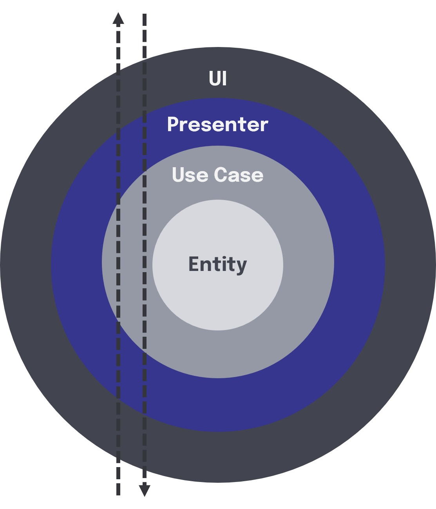

# GymHub

**GymHub** es una plataforma integral que unifica las aplicaciones de gimnasios, facilitando la gestión de membresías, reservas de clases y el seguimiento de la actividad física. Esta aplicación simplifica la experiencia del usuario, ofreciendo una herramienta económica y eficiente tanto para los usuarios como para los gimnasios.

## Arquitectura

La aplicación está estructurada en tres capas principales para facilitar el desarrollo, mantenimiento y escalabilidad:

1. **Capa de Dominio**: Centraliza la lógica de negocio y los casos de uso, gestionando la interacción con los datos. Define los métodos necesarios para acceder a los datos sin implementarlos, dejando esta implementación a la capa de datos.
   
2. **Capa de Datos**: Implementa los repositorios definidos en la capa de dominio, gestionando el acceso a datos, como consultas a bases de datos o APIs.

3. **Capa de Presentación/UI**: Maneja la interfaz de usuario (UI) y la lógica de presentación, utilizando un modelo como MVP (Modelo-Vista-Presentador) para actualizar la UI con los datos recibidos.

### Flujo de datos

El flujo de datos dentro de la arquitectura sigue una cadena de responsabilidades claramente definida:

1. **Componente**: Inicia la interacción, puede ser un clic de usuario o una carga inicial.
2. **Presentador**: Activa y coordina las acciones necesarias, solicitando datos al caso de uso.
3. **Caso de Uso**: Funciona como intermediario entre la capa de presentación y la capa de datos, solicitando información del repositorio.
4. **Repositorio**: Ejecuta la operación de datos necesaria, como recuperar datos de una API o acceder a la base de datos, y devuelve los resultados al caso de uso.

Este flujo ayuda a mantener el código organizado y facilita las pruebas y modificaciones futuras.

  

## Funcionalidades

La aplicación está dividida en dos partes principales:

### 1. Parte Usuario
Los usuarios pueden:
- Registrarse en gimnasios.
- Gestionar su actividad física.
- Hacer reservas para clases.
- Seguir su progreso de manera sencilla y cómoda.

### 2. Perfil Gimnasio
Los gimnasios pueden:
- Gestionar las inscripciones de los usuarios.
- Controlar las reservas de clases.
- Administrar la información relacionada con las membresías.

## Video de la Demo

[Ver video de la demo aquí](https://www.youtube.com/watch?v=5T_Y3E9p_mA)
